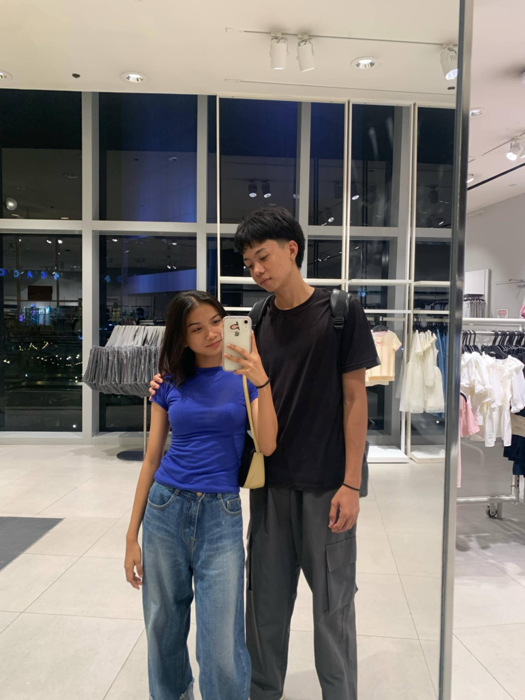

<!DOCTYPE html>
<html lang="en">
<head>
    <meta charset="UTF-8">
    <meta name="viewport" content="width=device-width, initial-scale=1.0">
    <title>My Autobiography</title>
    
</head>
<body>

<header>
    <h1>My Autobiography</h1>
</header>

<nav>
    <a href="#" onclick="showSection('profile')">Profile</a>
    <a href="#" onclick="showSection('about')">About Me</a>
    <a href="#" onclick="showSection('Education')">Educational Background</a>
    <a href="#" onclick="showSection('contact')">Contact</a>
</nav>

<main>
    <section id="profile" class="active">
        <h4>My Profile</h4>
        

            
            
Hello! I am <strong>Winnie Rose P. Montebon</strong>

        

    </section>

    <section id="about">
        <h2>About Me</h2>
        
I am <strong>Winnie Rose P. Montebon</strong>, 19 years of age, currently living at Marigondon, Lapu-Lapu City. I'm an extroverted person who loves traveling with family and friends. I enjoy being around people who share the same sense of humor and those who respect my feelings. So far, 2024 has been the best year of my life, as I’ve had the opportunity to travel to many places and meet genuinely kind people along the way.

        
Through these experiences, I also learned how to earn money by working part-time at a restaurant. Additionally, I’ve started a sideline where I help students with their schoolwork, supporting those who need assistance.

        
My motto in life: <strong>"Keep dreaming, and never give up"</strong>. I believe in staying resilient and persevering, no matter the challenges life presents.
 

        <h2>Skills</h2>
        
I have skills in <strong>Active listening</strong>, <strong>Solving Math Problems</strong>,
            <strong>Good Communication</strong>, <strong>Leadership</strong>, and <strong>Flexibility</strong>.

        <h2>Hobbies</h2>
        
In my free time, I <strong>play games like Valorant and Mobile Legends</strong>, <strong>watch K-drama series</strong>, <strong>love dancing</strong>, and <strong>read novels</strong>.

        <h2>Favorite Food</h2>
        <ol>
            <li>Lugaw (Rice Porridge)</li>
            <li>Mango</li>
            <li>Bubble Tea</li>
            <li>Mango Float</li>
            <li>Salad</li>
            <li>Seafoods</li>
            <li>Gummies</li>
            <li>Cake</li>
            <li>Fried Chicken</li>
            <li>Fries</li>
            <li>Sisig</li>
        </ol>
    </section>

    <section id="Education">
        <h1>Educational Background</h1> 
        <h2>Elementary</h2>
        
I graduated at <strong>Marigondon Elementary School</strong>, year 2017.

        <h2>High School</h2>
        
I completed my junior high school at <strong>Marigondon National High School</strong>, year 2020.

        
I graduated from <strong>Asian Learning Center</strong> as a STEM student, year 2023.

        <h2>College</h2>
        
Currently studying at <strong>Lapu-Lapu City College</strong> as a BindTech-CompTech student.

    </section>

    <section id="contact">
        <h2>Contact Me</h2>
        
☎ Number: 09284313980

        
📧 Email: <a href="mailto:winniemontebon18@gmail">winnie</a>

        
📘 Facebook: <a href="https://www.facebook.com/m.winnieee" target="_blank">Winnie</a>

        
📷 Instagram: <a href="https://www.instagram.com/m.winniee/?next=%2F" target="_blank">@m.winnie</a>

    </section>
</main>

</body>
</html>
